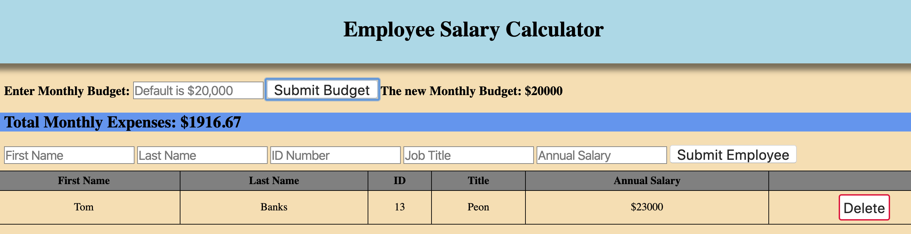

# Salary Calculator

## Description

Duration: 2 days

The business needs to calculate what their monthly expenses are based on their budget. They need a spreadsheet of all employees and
salaries to visually see where the money is being spent. They need to be able to see when a salary posted raises their monthly expenses
above their budget cap.

The program uses a monthly budget form for the user to adjust how much can be spent during each month. It has 5 inputs for the employee first name, last name, ID number, position, and yearly salary. After submitting a new employee, the employee data is added to a table with a delete button which, upon clicking, would remove the row the employee data is on. The total monthly expenses at the top increases as the
new employees have been added. Once the monthly budget value has been passed, the line turns red to visually indicate the overage. Once the amount has been dropped below the value, then it returns to the original blue color.

## Screen Shot

## Installation

Everything in this program is contained and linked to the HTML document. To run, just run the HTML document within a web browser.

## Built With

HTML, java script, jquery, css

## License

MIT

## Acknowledgement

Thank you to Prime Academy for assigning this project and my girlfriend for not getting mad at me for doing this instead of doing the dishes!

## Support

If you have any questions or issues, please email me at abungart@gmail.com
